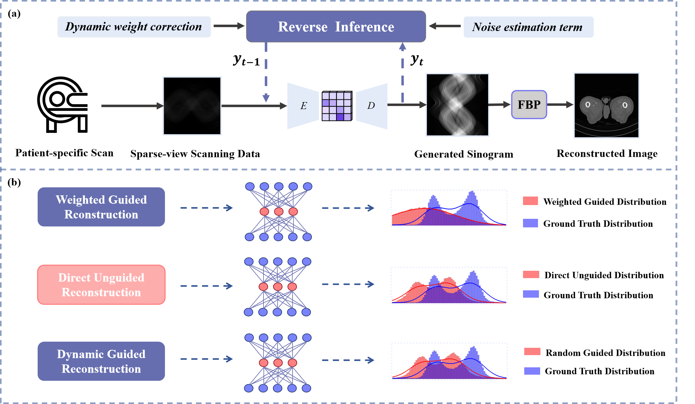
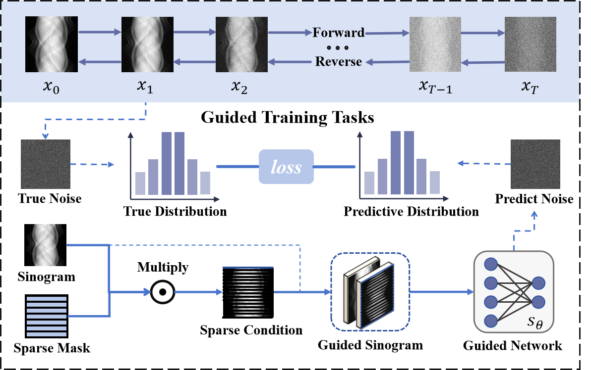
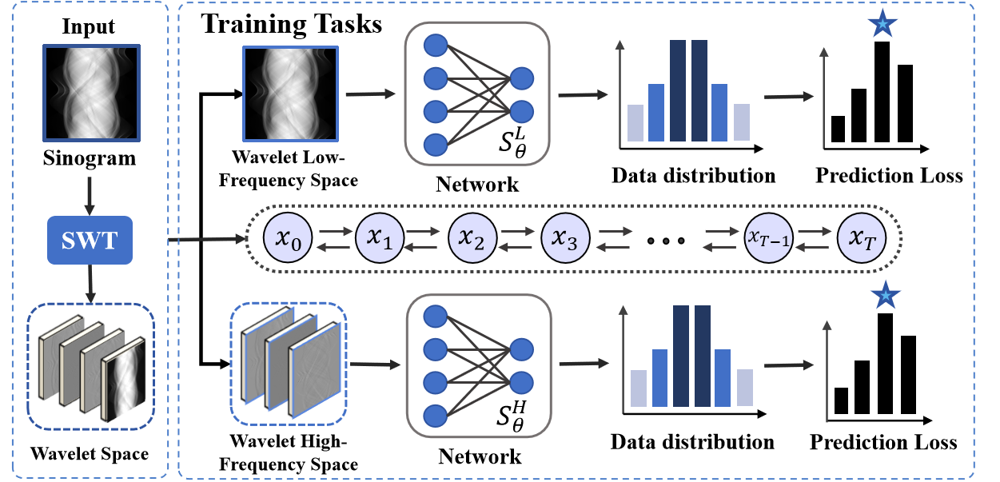
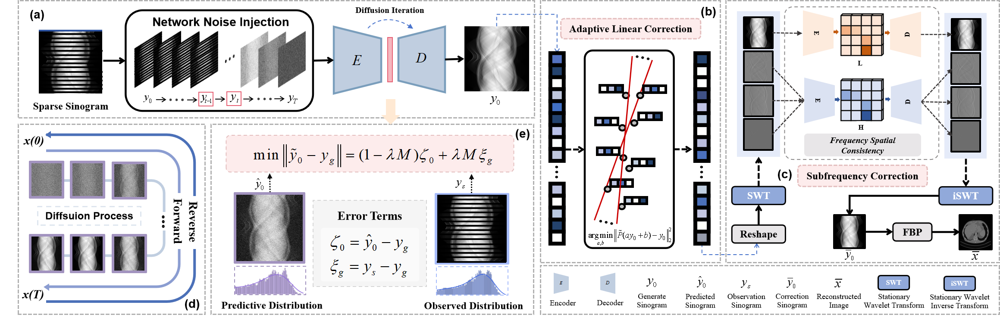
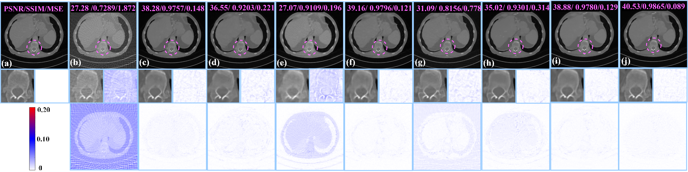
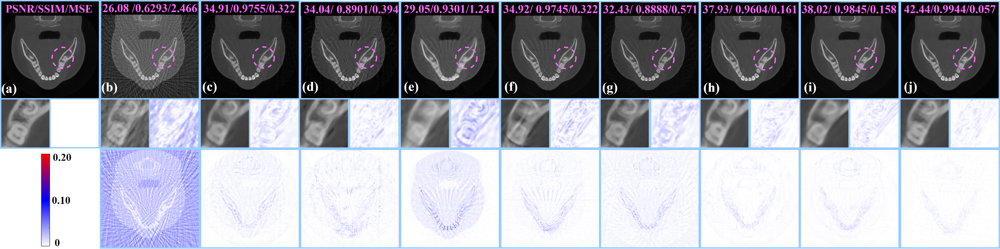
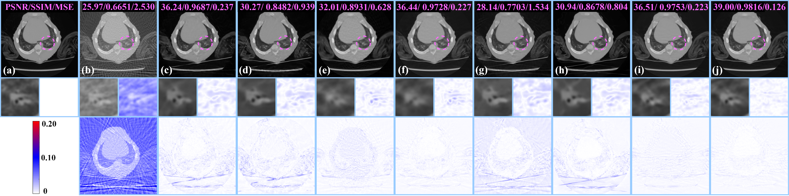
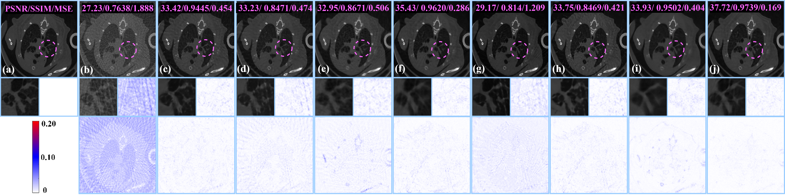
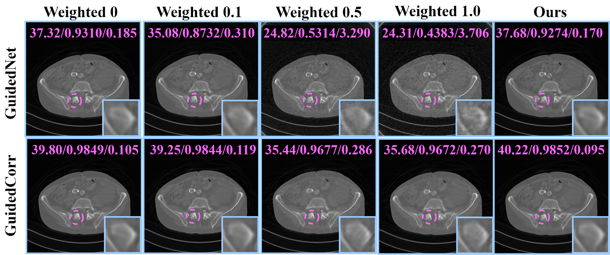
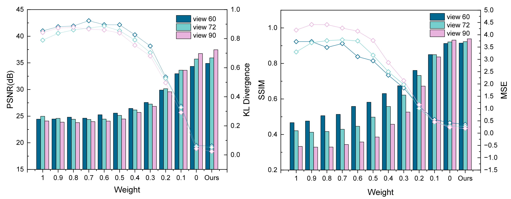

# STRIDE: Physics-Guided Null-Space Diffusion with Sparse Masking for Corrective Sparse-View CT Reconstruction
[](https://arxiv.org/abs/2509.05992)
[](https://opensource.org/licenses/MIT)
This repository contains the PyTorch implementation of the paper **"Physics-Guided Null-Space Diffusion with Sparse Masking for Corrective Sparse-View CT Reconstruction"**.
> **Code Availability:** The source code is available at [https://github.com/yqx7150/STRIDE](https://github.com/yqx7150/STRIDE).

## Abstract
Diffusion models demonstrate significant advantages in high-fidelity image generation, but their generated results may still deviate from the true data distribution. In medical image reconstruction, such deviations can compromise projection data consistency, causing severe artifacts and substantially undermining reconstruction accuracy and controllability. To address the above issues, we propose a physics-guided sparse condition temporal reweighted integrated distribution corrective null-space diffusion model (STRIDE) for sparse-view CT reconstruction.Specifically, we design a joint training mechanism guided by sparse conditional probabilities to facilitate the model effective learning of missing projection view completion and global information modeling. Based on systematic theoretical analysis, we propose a temporally varying sparse condition reweighting guidance strategy to dynamically adjusts weights during the progressive denoising process from pure noise to the real image, enabling the model to progressively perceive sparse-view information. The linear regression is employed to correct distributional shifts between known and generated data, mitigating
inconsistencies arising during the guidance process. Furthermore,we construct a global dual-network parallel architecture in the wavelet domain to jointly correct and optimize multiple subfrequency components, effectively mitigating the amplification of frequency deviations during backprojection and enabling highquality image reconstruction. Experimental results on both public and real datasets demonstrate that the proposed method achieves the best improvement of 2.58 dB in PSNR, increase of 2.37% in SSIM, and reduction of 0.236 in MSE compared to the best performing baseline methods. The reconstructed images exhibit excellent generalization and robustness in terms of structural consistency, detail restoration, and artifact suppression.
Index Terms—Sparse-view CT reconstruction, temporally reweighting, guided diffusion, distribution correction.

## Key Features
* **Range-Null Space Decomposition (RND):** Explicitly decomposes the CT image into a known component (derived from sparse projections) and an unknown null-space component (recovered by the diffusion model), ensuring strict physics constraints ($Ax=y$).
* **Temporally Varying Reweighting (TCRG):** Unlike static guidance, this strategy dynamically computes the optimal correction weight $\lambda_t$ at each timestep using linear regression, balancing the trade-off between the diffusion prior and data consistency.
* **Sparse Masking Training:** Incorporates random sparse masks during training to simulate the sparse-view acquisition process, enhancing the model's ability to handle missing projection data.
* **Corrective Sampling:** Mitigates distribution shifts and "hallucinations" by actively correcting the sampling trajectory towards the measurement subspace.

## Method Overview
<p align="center">
  
  <br>
  <em>Figure 1: (a) Illustration of the network architecture with guided correction weighting strategy. (b) Comparison of the distributional differences between generated results under different guided correction weighting strategies and the Ground Truth.</em>
</p>

<p align="center">
  
  <br>
  <em>Figure 2: Sparse Mask Embedded Conditional Guided Diffusion. Probabilistically embedded sparse mask into the conditional guided diffusion process,allowing the model to capture global projection information while emphasizing the completion of missing regions.</em>
</p>

<p align="center">
  
  <br>
  <em>Figure 3: Correction Training Strategy Based on SWT. The sinogram is decomposed by SWT into global low-frequency and detailed high-frequency components, which are trained separately to capture global structures and fine details for distribution correction.</em>
</p>

<p align="center">
  
  <br>
  <em>Figure 4: Overview of the proposed sparse-view CT reconstruction framework. (a) A temporally reweighted guided diffusion module provides fast coarse generation of projection data, ensuring global structural consistency under sparse-view conditions. (b) An adaptive linear data-consistency correction is then applied to enforce fidelity with the measured sinogram. (c) The refined projections are further decomposed by stationary wavelet transform (SWT), where low-frequency and high-frequency components are separately corrected by dedicated networks to capture both global trends and fine structural details. (d)Interpretation of diffusion process. (e) Temporal reweighting-guided correction process.</em>
</p>

## Results
<p align="center">
  
  <br>
  <em>Figure 5: Reconstruction images from 60 views sparse CT using the Mayo 2016 dataset. (a) The reference image is compared with reconstructions obtained by (b) FBP, (c) FBPConvNet, (d) RED-CNN, (e) HDNet, (f) GMSD, (g) DPS, (h) GOUB, (i) SWORD, and (j) STRIDE. The second row shows magnified
local regions to highlight the reconstruction of fine structural details. The third row presents the residual maps relative to the reference image, illustrating differences in artifact suppression, structural fidelity, and detail preservation across methods.</em>
</p>

<p align="center">
  
  <br>
  <em>Figure 6: Reconstruction images from 60 views sparse CT using the Dental Arch dataset. (a) The reference image is compared with reconstructions obtained by (b) FBP, (c) FBPConvNet, (d) RED-CNN, (e) HDNet, (f) GMSD, (g) DPS, (h) GOUB, (i) SWORD, and (j) STRIDE. The second row shows magnified
local regions to highlight the reconstruction of fine structural details. The third row presents the residual maps relative to the reference image, illustrating differences in artifact suppression, structural fidelity, and detail preservation across methods.</em>
</p>

<p align="center">
  
  <br>
  <em>Figure 7: Reconstruction images from 60 views sparse CT using the Piglet Dataset. (a) The reference image is compared with reconstructions obtained by (b)FBP, (c) FBPConvNet, (d) RED-CNN, (e) HDNet, (f) GMSD, (g) DPS, (h) GOUB, (i) SWORD, and (j) STRIDE. The second row shows magnified local
regions to highlight the reconstruction of fine structural details. The third row presents the residual maps relative to the reference image, illustrating differences in artifact suppression, structural fidelity, and detail preservation across methods.</em>
</p>

<p align="center">
  
  <br>
  <em>Figure 8: Reconstruction images from 60 views sparse CT using the Mouse DECT Dataset. (a) The reference image is compared with reconstructions obtained by (b) FBP, (c) FBPConvNet, (d) RED-CNN, (e) HDNet, (f) GMSD, (g) DPS, (h) GOUB, (i) SWORD, and (j) STRIDE. The second row shows magnified
local regions to highlight the reconstruction of fine structural details. The third row presents the residual maps relative to the reference image, illustrating differences in artifact suppression, structural fidelity, and detail preservation across methods</em>
</p>

<p align="center">
  
  <br>
  <em>Figure 9: Effect of different guidance weighting strategies. The first row compares reconstructions without weighting, with weights 0.1 and 0.5, and with the proposed temporally reweighted strategy. The second row shows the combined effect of the first stage with the second-stage refinement,demonstrating the efficacy of the temporally reweighted guidance in enhancing reconstruction fidelity</em>
</p>

<p align="center">
  
  <br>
  <em>Figure 10: Impact of guidance weighting on reconstruction and distribution alignment. PSNR, SSIM, MSE and KL divergence are evaluated for weights from 0 to 1 with step 0.1, with the final point representing the proposed STRIDE method. The results highlight the superior performance and stability
of STRIDE, illustrating how temporally reweighted guidance effectively balances reconstruction fidelity and distribution consistency.</em>
</p>


## Citation
```bibtex
If you use this code or find our work useful, please cite:
@article{zhou2025stride,
  title={Physics-Guided Null-Space Diffusion with Sparse Masking for Corrective Sparse-View CT Reconstruction},
  author={Zhou, Zekun and Gong, Yanru and Shi, Liu and Liu, Qiegen},
  journal={arXiv preprint arXiv:2509.05992},
  year={2025}
}


